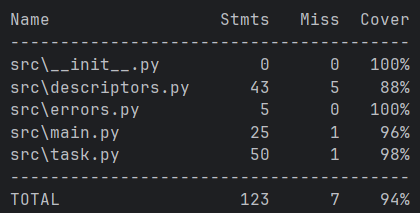

# Лабраторная работа №2 (второй семестр)

## Запуск программы
 uv run python -m src.main

## Запуск тестов
 uv run pytest

## Запуск тестов с покрытием
uv run pytest --cov=src

## Структура проекта

 <pre>
    ├── lab<# лабораторная работа>             
        ├── src/    
            ├── descriptors.py                 # data и non-data дескрипторы
            ├── errors.py                      # классы исключений
            ├── main.py                        # основной файл
            ├── task.py                        # класс Task
        ├── tests/                             # Unit тесты
        ├── uv.lock                            # зависимости проекта
        ├── .gitignore                         # git ignore файл
        ├──.pre-commit-config.yaml             # Средства автоматизации проверки кодстайла
        ├── README.md                          # Описание проекта, с описанием файлов 
</pre>

## Класс Task

### Свойства:  

**id** - нельзя менять  
**description** - описание можно менять, реализована проверка на то, что значение допустимо  
**priority** - приоритет можно менять, реализована проверка на то, что значение допустимо  
**time_created** - время создания, нельзя менять  
**status** - можно менять через метод set_status (проверяется, допустимый ли статус и можно ли в него перейти,
например, из created в done нельзя перейти) 

### Методы: 
**start** - запускаем задачу  
**complete** - завершаем задачу  
**change_priority** - изменяем приоритет (повышается на 1 каждые 5 секунд) 
**is_ready** - проверяем, готова ли задача к выполнению  
**set_status** - изменяем статус  

## Дескрипторы
* Для id и time_created использую @property (это data descriptor), чтобы 
лучше защитить эти поля ещё применён __setattr__. Благодаря этому через _ изменить атрибут тоже не получится.
* Description защищён с помощью StringField (data descriptor), он проверяет, что описание является непустой строкой
* Priority защищён с помощью PriorityField (data descriptor), он проверяет, что приоритет является числом от 1 до 5
* Для статуса использую NotChange (non-data descriptor) и set_status из Task, что позволяет ограничить изменение статуса

## Исключения 
* EmptyFieldError - пустое поле в описании
* InvalidTypeError - неверный тип 
* PriorityError - ошибка в поле приоритета
* InvalidChangeStatus - некорректное изменение статуса
* ChangeReadOnlyError - изменение поля, предназначенноо только для чтения
* Иногда использую встроенное исключение AttributeError

## Main
В main реализован пример того, как можно работать с классомм Task. 
Там создаются 5 задач, сортируются по приоритетам и по очереди выполняются, изменяются статусы и приоритеты.

## Допущения
* У меня id представлен положительным числом. Уникальность я не проверяю, за это отвечает 
пользователь, создавая задачу.
* Для id я не стала писать свой дескриптор, просто добавила в __setattr__ 
проверку на то, что при создании мы устанавливаем положительное число в поле id
* Для реалистичности использую sleep в start

## Тестирование
Покрытие составляет 94%
